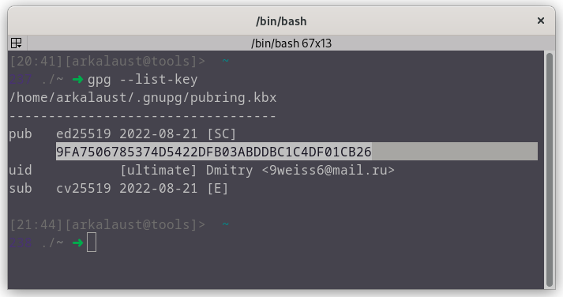

# Backup


## Описание

Скрипт `backups-create.sh` служит для создания бэкапа

Скрипт `backups-recovery.sh` служит для восстановления данных из бэкапа (**Важно! Используйте ключи шифрования такие же, как и при создании бэкапов**)

О том, как работает каждый из этих скриптов, читайте ниже.

> `backups-recovery.sh` использовать с осторожностью (по-умолчанию, переносит архивные файлы в основную дирекорию `/`, если не задана другая директория). Проблемы могут быть, если вы в первом аргументе($1) команды `backups-create.sh` передавали свои параметры отличные от тех, которые есть по-умолчанию (бэкапили свои директории), то при восстановлении, могут возникнуть проблемы. Например, вы забэкапили директорию `/root` и пытаетесь её восстановить.

---

### Как работает скрипт для бэкапа

Команда для создания бэкапа выглядит так:

```bash
# sh backups-create.sh $1 $2 $3 $4
# $1 $2 $3 $4 - это аргументы команды

sh backups-create.sh default s 9FA7506785374D5422DFB03ABDDBC1C4DF01CB26
```

- `$1`: Аргумент отвечающий за выбор директорий для бэкапа. По-умолчанию, `default` (`/home/<user>` User-автоматически вставит имя конретного пользователя).
- `$2`: Аргумент отвечающий за выбор исключений  из бэкапа (см. подробности ниже). По-умолчанию, `s` (Заданный список исключений. Вы можете задать свой список в файле и передать директорию к этому файле в качестве аргумента)
- `$3`: Аргумент в который передаётся ключ GPG для шифрования полученного бэкапа. (Где взять ключ, см. подробности ниже)
- `$4`: **Необязательный** аргумент. Если поставить `delete-old`, то перед созданием бэкапа, будет удалён старый бэкап архив
---

### Как работает скрипт для восстановления из бэкапа

Команда для восстановления бэкапа выглядит так:

```bash
# sh backups-recovery.sh $1
# $1 - это аргумент команды

sh backups-recovery.sh arkalaust_2022-08-23
```

- `$1`: Аргумент, в котором указывается название backup-файла (arkalaust_2022-08-23.tar.gz.asc) но без расширения файла (.tar.gz.asc).
- `$2`: **Необязательный** аргумент отвечающий за выбор директорий, куда будут перемещены файлы из бэкапа (по-умолчанию, это директория `/`). Переданная директория, обязательно должна существовать (полный путь к директории можно узнать командой `pwd`).

>При дешифровки архива GPG ключом, будет автоматически применён ключ в вашей системе. Как импортировать GPG ключ в систему, читайте ниже


## Подготовка

### Формирование списка бэкапа и исключений

#### **Список бэкапа**

Для бэкапа по-умолчанию используются стандартные директории корневого каталога `/home/<user>`, но вы можете указать свои, передав их в аругумент `$1` в качестве строки (**главное, чтобы они были в корневом каталоге `/`**).

```bash
sh backups-create.sh "/home /usr" $2 $3
```

#### **Список исключений**

Тоже самое и для исключений (каталоги и файлы, которые не будут включены в бэкап).

По-умолчанию, исключены будут данные файлы и директории:

```bash
...
--exclude="virtualbox" \
--exclude=".cache/*" \
--exclude="*Cache*/*" \
--exclude="backups" \
--exclude="downloads" \
--exclude="*tmp/*" \
--exclude="Downloads" \
--exclude="Documents" \
--exclude="Pictures" \
--exclude=".Trash" \
--exclude=".local/*" \
--exclude="virtualbox" \
...
```

Чтобы указать свои исключения, передайте в аргументе `$2` путь к файлу с исключенниями `exclude.lst` в который, вы можете вписать то, что вам не нужно в бэкапе:

```bash
sh backups-create.sh $1 exclude.lst $3
```

Примерное содержание `exclude.lst`:

```text
...
virtualbox
.cache/*
Downloads
.local/*
...
```

---

### Шифрование бэкапа

Для того, чтобы бэкап был в безопасности, будем использовать шифрование с GPG 

#### Генерация ключей для шифрования

> Для шифрования архива с бэкапом, будем использовать утилиту GPG - практически всегда она уже установлена в системе "из коробки".

Сгенерировать ключи с указанием своих настроект генерации (таких как, алгоритм шифрования, длина ключи в битах, время жизни ключа):

```bash
gpg --full-gen-key 
```

Или ввести для быстрой генерации ключа с настройками по-умолчанию:

```bash
gpg --gen-key
```

Если ключи уже имеются, то для вывода списка всех доступных открытых ключей с их идентификаторами, выполним:

```bash
gpg --list-key
# или
gpg -K # покажет приватные ключи
gpg -k # покажет публичные ключи
```



Скопируйте сгенерированный публичный ключ (пример на фото) и вставьте его в качестве третьего аргумента `$3`:

```bash
sh backups-create.sh -- $1 $2 9FA7506785374D5422DFB03ABDDBC1C4DF01CB26
```

#### Хранение ключей шифрования

> Обязательно сохраните данные ключи шифрования в надежном месте (на флешке или где-нибудь ещё), иначе, без них вы не сможете дешифровать бэкап в самый ответственный момент!

Для сохранения ключа в файл, просто введите команду ниже с указанием `email` от `uid` (см. фото выше):

```bash
gpg --export -a 9weiss6@mail.ru > public.gpg
gpg --export-secret-key -a 9weiss6@mail.ru > secret.gpg
```

**Пояснение**:
- `--export` Экспорт публичных ключей
- `--export-secret-key` Экспорт приватных ключей
- `-a` Кодировка бинарника в понятный ASCII (По-умолчанию, GPG выводит в бинарник)
- `> secret.gpg` Название директории и файл, куда будут записан ключ

Теперь, вы можете записать полученные файлы на флешку и воспользоваться ими, когда придёт время! 

Но, для безопасности, можно ещё удалить эти сгенерированные ключи из системы:

```bash
# Удаление приватных ключей
gpg --delete-secret-keys 9weiss6@mail.ru

# Удаление публичных ключей
gpg --delete-keys 9weiss6@mail.ru
```

А когда придёт время, импортировать из своей флешки:

```bash
# Импорт секретных ключей
gpg --import secret.gpg

# Импорт публичных ключей
gpg --import public.gpg
```
